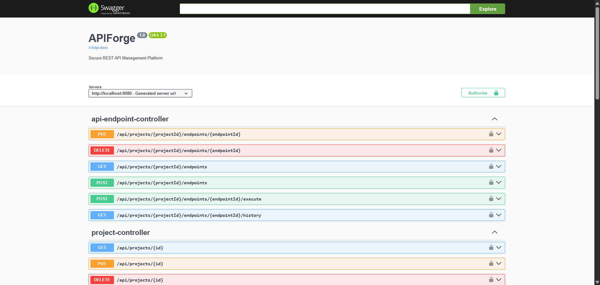
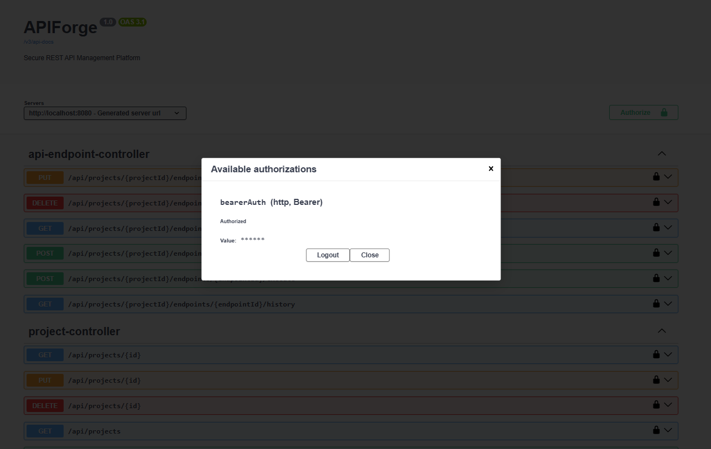
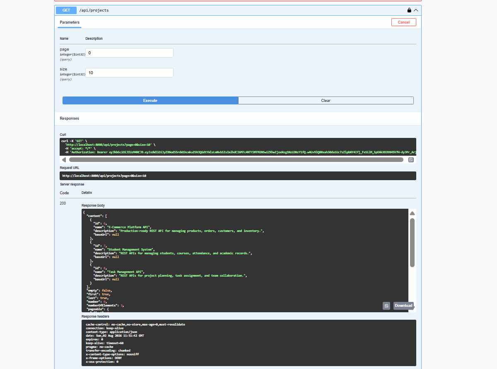
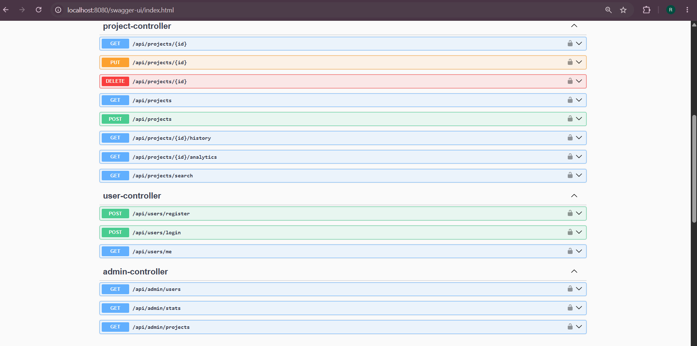

<div align="center">

# 🚀 APIForge

### Secure REST API Management Platform

Build, Secure, Manage and Analyze REST APIs with JWT Authentication, Spring Security, Swagger, Docker, and Project Analytics.

<p>


</p>

*A production-oriented backend platform for securely managing, documenting, executing, and analyzing REST APIs.*

</div>

---

# 📌 Overview

APIForge is a production-inspired REST API Management Platform built using **Spring Boot** that enables developers to organize, secure, execute, and monitor REST APIs through a centralized workspace.

Unlike a traditional CRUD application, APIForge focuses on modern backend engineering practices including **JWT Authentication**, **Role-Based Authorization**, **Spring Security**, **Dockerized Deployment**, **Swagger/OpenAPI Documentation**, **Execution Tracking**, and **Project Analytics**.

The platform allows developers to group APIs into projects, securely access protected resources, execute registered endpoints, monitor execution history, and analyze project-level API usage through a clean and scalable architecture.

---

## 📑 Table of Contents

- [📌 Overview](#-overview)
- [📸 Application Preview](#-application-preview)
- [✨ Key Features](#-key-features)
- [🔐 Authentication & Authorization](#-authentication--authorization)
- [📁 Project Management](#-project-management)
- [🌐 API Endpoint Management](#-api-endpoint-management)
- [📊 Project Analytics](#-project-analytics)
- [📜 API Execution History](#-api-execution-history)
- [📖 Swagger Documentation](#-swagger-documentation)
- [🏗️ System Architecture](#️-system-architecture)
- [📂 Project Structure](#-project-structure)
- [⚙️ Technology Stack](#️-technology-stack)
- [🐳 Docker Support](#-docker-support)
- [🚀 Getting Started](#-getting-started)
- [🧪 Testing](#-testing)
- [📈 Future Roadmap](#-future-roadmap)
- [🤝 Contributing](#-contributing)
- [📄 License](#-license)
- [👨‍💻 Author](#-author)

  
# 📸 Application Preview

### Interactive Swagger Documentation

APIForge provides a fully interactive Swagger/OpenAPI interface that enables developers to explore, authenticate, and test REST APIs directly from the browser.

<p align="center">

</p>

---

# 🔐 Authentication & Authorization

APIForge secures every protected endpoint using **JWT Authentication** and **Spring Security**.

After successful authentication, the server generates a signed JWT access token that is used as a **Bearer Token** to access secured APIs.

### User Login & JWT Token Generation

The login endpoint authenticates users using their email and password before returning a signed JWT access token.

<p align="center">

</p>

---

### Bearer Token Authorization

Swagger UI allows developers to authorize once using the generated JWT token and securely test every protected API without additional configuration.

<p align="center">

</p>

---

# 📁 Project Management

APIForge organizes REST APIs into independent projects, allowing developers to manage multiple applications from a single platform.

Each project supports:

- ✅ Create Projects
- ✅ Update Projects
- ✅ Delete Projects
- ✅ Search Projects
- ✅ Pagination Support
- ✅ Project-specific Analytics
- ✅ Execution History

<p align="center">

</p>

---
# 🌐 API Endpoint Management

APIForge provides a centralized workspace for organizing, managing, and executing REST API endpoints within individual projects.

Instead of maintaining APIs across multiple tools, developers can register endpoints, execute requests, and monitor activity from a single platform.

### Supported Operations

- ➕ Register API Endpoints
- ✏️ Update Existing Endpoints
- ❌ Delete Endpoints
- ▶ Execute APIs
- 📜 View Execution History
- 📊 Analyze Endpoint Activity

<p align="center">

</p>

---

# 📊 Project Analytics

APIForge goes beyond traditional CRUD functionality by providing project-level analytics that help developers understand API usage and execution patterns.

The analytics engine generates meaningful insights for every project using stored execution data, allowing developers to monitor application behavior without manually querying the database.

### Analytics Overview

- 📈 Project Statistics
- 📊 API Execution Metrics
- 📋 Registered Endpoint Count
- ⚡ API Usage Monitoring
- 📉 Project Activity Insights

<p align="center">

</p>

---

# 📜 API Execution History

Every API execution performed within APIForge is automatically recorded, providing complete traceability and historical insights.

Execution history enables developers to review previous API calls, inspect execution results, and analyze endpoint activity over time.

### Execution History Includes

- ⏱ Execution Timestamp
- 🌐 Executed Endpoint
- 📡 HTTP Method
- 📄 API Description
- 📊 Execution Records

<p align="center">

</p>

---
# ✨ Key Features

APIForge is designed as a production-oriented backend platform rather than a traditional CRUD application.

### Core Features

- 🔐 JWT Authentication
- 👥 Role-Based Authorization
- 🛡 Spring Security Integration
- 📖 Interactive Swagger/OpenAPI Documentation
- 📁 Project Management
- 🌐 REST API Endpoint Management
- ▶ API Execution Engine
- 📊 Project Analytics
- 📜 Execution History
- 🔍 Project Search
- 📄 Pagination Support
- ⚠ Global Exception Handling
- 📦 DTO-Based Request & Response Layer
- 🐳 Dockerized Deployment
- ⚙ Environment-Based Configuration
- 🧪 Unit Testing with JUnit
- 🏗 Layered Architecture

---

# ⚙️ Technology Stack

## Backend

- Java 21
- Spring Boot 3.5.x
- Spring Security
- Spring Data JPA
- JWT Authentication
- Maven
- MySQL
- Hibernate

## API Documentation

- Swagger UI
- OpenAPI 3

## DevOps

- Docker
- Docker Compose

## Testing

- JUnit 5

## Tools

- IntelliJ IDEA
- Git
- GitHub
- Postman

---

# 🏗️ System Architecture

APIForge follows a layered architecture that separates business logic, security, persistence, and API communication into independent layers for improved maintainability and scalability.

```text
                    Client Applications
                            │
                            ▼
                  Swagger UI / REST Client
                            │
                            ▼
                  Spring Security (JWT)
                            │
                            ▼
                    REST Controllers
                            │
                            ▼
                     Service Layer
                            │
                            ▼
                  Repository Layer (JPA)
                            │
                            ▼
                          MySQL
```

---

# 📂 Project Structure

```text
APIForge
│
├── src
│   ├── main
│   │   ├── java
│   │   │   └── com.reshu.apiforge
│   │   │       ├── config
│   │   │       ├── controller
│   │   │       ├── dto
│   │   │       ├── entity
│   │   │       ├── exception
│   │   │       ├── repository
│   │   │       ├── security
│   │   │       ├── service
│   │   │       └── ApiforgeApplication
│   │   │
│   │   └── resources
│   │       └── application.properties
│   │
│   └── test
│       └── java
│
├── assets
├── Dockerfile
├── compose.yaml
├── pom.xml
└── README.md
```

---
# 🐳 Docker Support

APIForge is fully containerized, making it easy to build, deploy, and run consistently across different environments.

### Included Docker Resources

- Dockerfile
- Docker Compose
- Environment-Based Configuration
- Production-Oriented Build Setup

Run the application using Docker:

```bash
docker compose up --build
```

---

# 📖 Swagger Documentation

APIForge integrates Swagger/OpenAPI to provide interactive REST API documentation.

Developers can explore, authenticate, and test every endpoint directly from the browser without additional tools.

After running the application, Swagger is available at:

```text
http://localhost:8080/swagger-ui/index.html
```

---

# 🚀 Getting Started

## Clone Repository

```bash
git clone https://github.com/ReshuKumari05/APIForge.git
```

---

## Configure Environment

Update your database and security configuration before starting the application.

```properties
DB_URL=
DB_USERNAME=
DB_PASSWORD=
JWT_SECRET=
```

You can also duplicate the provided configuration template.

```text
.env.example
```

↓

```text
.env
```

---

## Build Application

```bash
mvn clean install
```

---

## Run Application

```bash
mvn spring-boot:run
```

---

# 🧪 Testing

APIForge includes testing support for validating backend functionality.

### Testing Tools

- Spring Boot Test
- JUnit 5
- Swagger UI
- Postman
- IntelliJ HTTP Client (`test.http`)

---

# 📈 Future Roadmap

Planned enhancements include:

- Refresh Token Authentication
- Email Verification
- Password Reset
- Redis Caching
- API Rate Limiting
- CI/CD Pipeline
- Kubernetes Deployment
- Monitoring & Logging
- Multi-Tenant Architecture
- API Versioning
- API Performance Metrics

---

# 🤝 Contributing

Contributions, suggestions, and improvements are welcome.

If you'd like to improve APIForge, feel free to fork the repository, create a feature branch, and submit a Pull Request.

---

# 📄 License

This project is licensed under the MIT License.

See the `LICENSE` file for more information.

---

# 👨‍💻 Author

## Reshu Kumari

**Backend Developer | Java & Spring Boot Enthusiast**

Passionate about building secure, scalable, and production-ready backend applications using Java, Spring Boot, REST APIs, JWT Authentication, Docker, and modern software engineering practices.

- **GitHub:** https://github.com/ReshuKumari05
- **LinkedIn:** https://www.linkedin.com/in/reshu-kumari-7b72b0292/

---

⭐ If you found this project useful, consider giving it a star.
